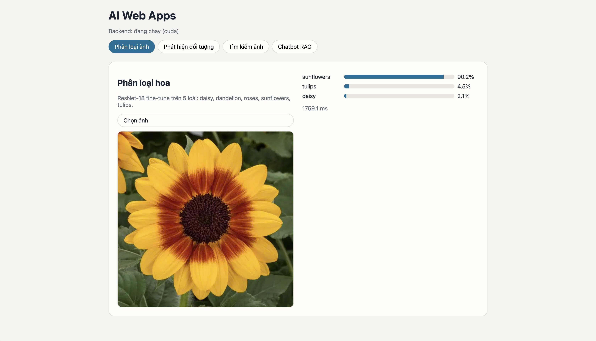
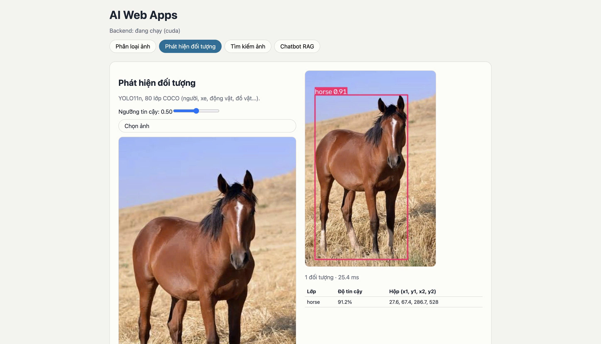
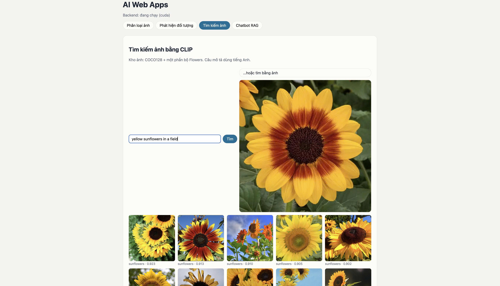
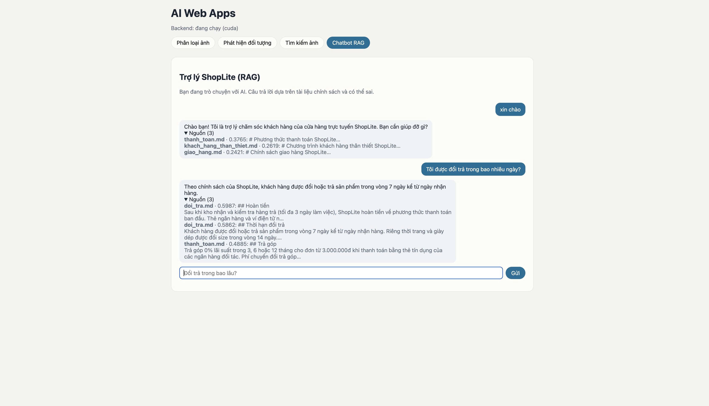

# AI Web Apps — 4 chức năng AI trên một trang web

Bài tập nhóm học phần **Lập trình Web nâng cao** (Phenikaa University).
Một trang web gồm 4 chức năng AI chạy trên cùng một backend FastAPI: phân loại hoa, phát hiện đối tượng, tìm kiếm ảnh và chatbot RAG.

> Mã nguồn dựa trên notebook `AI_Web_Apps_Streamlit_React.ipynb` do giảng viên cung cấp. Nhóm chạy notebook, huấn luyện/nạp mô hình, kiểm tra từng chức năng trên web và đóng gói dự án này.

## Thành viên

| Họ và tên | MSSV | Phụ trách |
|---|---|---|
| Phạm Thảo Hiền Vy | 24100439 | [điền theo việc thực tế đã làm] |
| Đào Bá Tuấn Ngọc | 24100498 | [điền theo việc thực tế đã làm] |
| Phạm Thế Duy | 24100583 | [điền theo việc thực tế đã làm] |
| Nguyễn Văn An | 24100254 | [điền theo việc thực tế đã làm] |

## Ảnh giao diện

**1. Phân loại hoa** — ResNet-18 nhận đúng hướng dương (90,2%).



**2. Phát hiện đối tượng** — YOLO11n vẽ khung và nhãn `horse 0.91`.



**3. Tìm kiếm ảnh** — truy vấn tiếng Anh `yellow sunflowers in a field` trả về toàn ảnh hoa hướng dương.



**4. Chatbot RAG** — trợ lý cửa hàng ShopLite trả lời kèm các đoạn tài liệu nguồn.



## Kiến trúc

```
Trình duyệt ──► React (build sẵn) hoặc Streamlit ──► FastAPI ──► core/ (4 mô hình, nạp một lần)
                                                       /api/classify · /api/detect
                                                       /api/search/* · /api/chat (SSE)
```

- `core/`: chỉ chứa phần suy luận của mô hình, không biết gì về web.
- `api/`: bọc `core/` thành API HTTP (FastAPI), đồng thời phục vụ bản build React trong `web/dist`.
- `web/` (React + Vite) và `streamlit_app.py`: hai giao diện cùng gọi một API.
- `config.py`: cấu hình bằng biến môi trường, không hard-code tên mô hình.
- `artifacts/`: mô hình đã huấn luyện và file số đo (`metrics.json`).

## Mô hình và kết quả

| Chức năng | Mô hình | Dữ liệu | Kết quả |
|---|---|---|---|
| Phân loại hoa | ResNet-18 (fine-tune từ ImageNet) | TF Flowers, 3.670 ảnh, 5 lớp | Accuracy 95,1%, F1 95,1% trên tập test |
| Phát hiện đối tượng | YOLO11n (pretrained COCO, 80 lớp) | COCO128 | mAP50 0,67; mAP50-95 0,50 |
| Tìm kiếm ảnh | CLIP ViT-B/32 + FAISS | COCO128 + ảnh hoa, kho 628 ảnh | Precision@5 (ảnh → ảnh) 0,88 |
| Chatbot RAG | MiniLM đa ngôn ngữ + FAISS + Qwen2.5-1.5B-Instruct | 6 tài liệu chính sách ShopLite | Hit@1 = Hit@3 = 1,0 trên 10 câu hỏi |

Số đo lấy từ `artifacts/*/metrics.json` và `artifacts/rag_metrics.json`. Xem thêm phần Hạn chế bên dưới trước khi đọc các con số này.

## Cách chạy

Cách dễ nhất là mở notebook trên Google Colab, bật GPU T4 rồi chọn **Chạy tất cả**. Cuối notebook in ra link công khai của giao diện React và Streamlit.

Chạy trên máy (Python 3.11, Node 22):

```bash
pip install -r requirements.txt
uvicorn api.main:app --port 8000          # backend + giao diện React đã build (mở http://localhost:8000)
API_URL=http://localhost:8000 streamlit run streamlit_app.py   # giao diện Streamlit (cài thêm requirements-streamlit.txt)
cd web && npm install && npm run dev      # React ở chế độ phát triển
```

| Biến môi trường | Mặc định | Ý nghĩa |
|---|---|---|
| `ENABLED_MODELS` | `classifier,detector,retrieval,llm` | Mô hình được nạp |
| `LLM_MODEL` | `Qwen/Qwen2.5-1.5B-Instruct` (GPU) / `Qwen/Qwen2.5-0.5B-Instruct` (CPU) | Mô hình sinh câu trả lời |
| `EMBED_MODEL` | `sentence-transformers/paraphrase-multilingual-MiniLM-L12-v2` | Embedding cho RAG |
| `CLIP_MODEL` | `openai/clip-vit-base-patch32` | Tìm kiếm ảnh |
| `CORS_ORIGINS` | `http://localhost:5173,http://localhost:8501` | Địa chỉ được phép gọi API |

## Hạn chế

- **Phân loại hoa** chỉ biết 5 loài (cúc, bồ công anh, hoa hồng, hướng dương, tulip). Ảnh hoa loài khác vẫn bị gán vào một trong 5 loài này.
- **Phát hiện đối tượng**: mAP được đo trên COCO128, là tập con của COCO mà mô hình pretrained có thể đã gặp khi huấn luyện, nên số này không phản ánh đầy đủ chất lượng trên ảnh mới.
- **Tìm kiếm ảnh** chỉ hiểu truy vấn tiếng Anh (CLIP bản gốc). Kho ảnh nhỏ (628 ảnh).
- **Chatbot** dùng mô hình nhỏ nên có thể trả lời sai hoặc bịa. Hit@3 = 1,0 chỉ đo trên 10 câu hỏi do notebook soạn sẵn, không đủ để kết luận chatbot tốt.
- Nhóm chưa triển khai lên máy chủ cố định. Link demo chỉ sống khi phiên Colab còn chạy.

## Khai báo sử dụng AI

Công cụ AI dùng để làm bài:

| Công cụ | Phiên bản | Dùng để |
|---|---|---|
| Claude (Anthropic) | Claude Sonnet 5 | Hướng dẫn chạy notebook, đưa code lên GitHub, soạn README và slide |
| [AI khác nếu có] | [Phiên bản] | [Mục đích] |

Mô hình AI chạy trong sản phẩm: ResNet-18 (torchvision), YOLO11n (Ultralytics), CLIP ViT-B/32 (`openai/clip-vit-base-patch32`), `paraphrase-multilingual-MiniLM-L12-v2`, Qwen2.5-Instruct.
